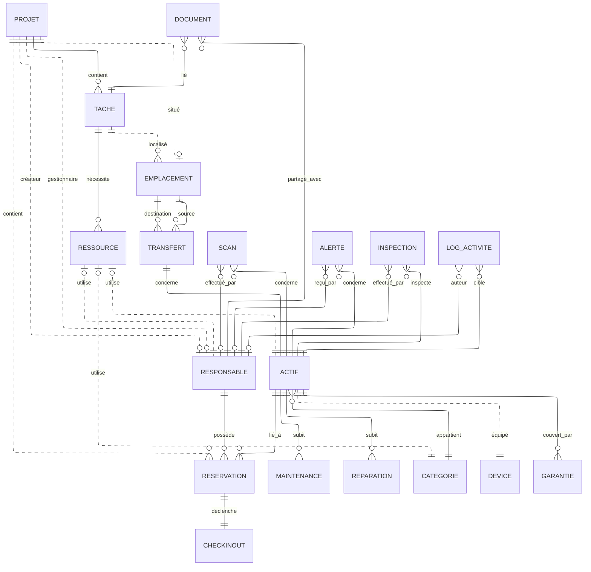

# Saas facturation freelance

```mermaid
---
    config:
        layout: elk
---
erDiagram
    RESPONSABLE 1--0+ RESERVATION : possède
    ACTIF 1--0+ MAINTENANCE : subit
    ACTIF 1--0+ REPARATION : subit
    ACTIF 1--0+ RESERVATION : lié_à
    RESERVATION 1--1 CHECKINOUT : déclenche
    ACTIF 0+--1 CATEGORIE : appartient

    TACHE 1--0+ RESSOURCE : nécessite
    RESSOURCE o|..1 ACTIF : utilise
    RESSOURCE o|..1 RESPONSABLE : utilise
    RESSOURCE o|..1 CATEGORIE : utilise

    PROJET 1--0+ TACHE : contient
    PROJET 1..o| RESPONSABLE : créateur
    PROJET 1..o| RESPONSABLE : gestionnaire
    PROJET 1..0+ RESERVATION : contient
    PROJET 1..o| EMPLACEMENT : situé
    TACHE 1..0+ EMPLACEMENT : localisé
    EMPLACEMENT 1--0+ TRANSFERT : source
    EMPLACEMENT 1--0+ TRANSFERT : destination
    TRANSFERT 1--1 ACTIF : concerne
    ACTIF 1..1 DEVICE : équipé
    ACTIF ||--0+ GARANTIE : couvert_par
    DOCUMENT 0+--|| TACHE : lié
    DOCUMENT 0+--|| RESPONSABLE : partagé_avec
    SCAN 0+--|| ACTIF : concerne
    SCAN 0+--o| RESPONSABLE : effectué_par
    ALERTE 0+--|| ACTIF : concerne
    ALERTE 0+--o| RESPONSABLE : reçu_par
    INSPECTION 0+--|| ACTIF : inspecte
    INSPECTION 0+--|| RESPONSABLE : effectué_par
    LOG_ACTIVITE 0+--|| ACTIF : cible
    LOG_ACTIVITE 0+--o| RESPONSABLE : auteur


```